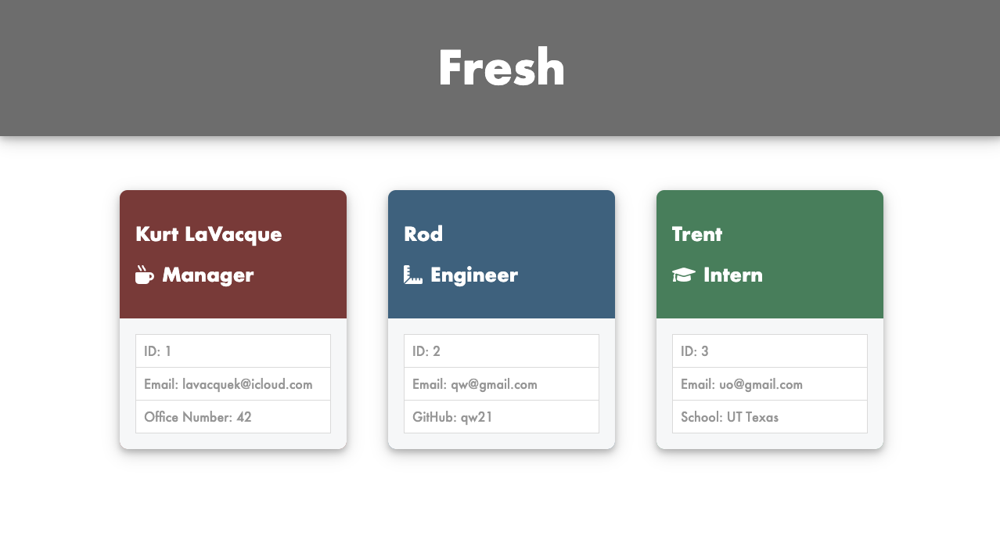

# Team-Profile-Generator

 [Link to Sample of HTML](https://livingkurt.github.io/Team-Profile-Generator/.)

## About The Project

I created a Github pdf creator that takes takes in 2 pieces of of information
* Your Github Username
* Your Favorite Color

Then produces a sleek and clean pdf of all your github user information to be used with clients and interviews.

### Features
* Automatic Github stats
* Choose from 4 different colors themes
* Links to you blog, github page, and your city shown on google maps

### Built With

* [Javascript](https://developer.mozilla.org/en-US/docs/Web/JavaScript)
* [Node.js](https://nodejs.org/en/docs/)
* [Inquirer](https://www.npmjs.com/package/inquirer)

<!-- GETTING STARTED -->
## Getting Started

<!--  -->
### Open up your terminal
* Change directory to the repo directory
* Type into terminal "node app.js"
* Press Enter
### You will be asked asked to enter the admin password (password = admin)

* If password answered incorrectly you will not be given access to continue
* If you enter the password correctly you will be asked a series of question regarding the manager
* Then for each employee in your team
* After each team mate is made, you will be asked if you would like to create another team member
* If you type yes
    * Then it will repeat the questions given to create a employee
* If you type no
    * Then it will create a team.html file in the output folder with all of the information that was asked of you

Sample Screenshot

